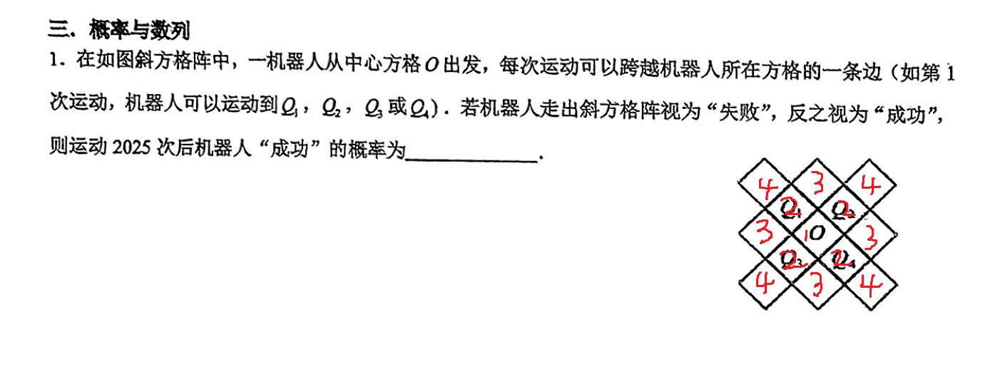

# 马尔可夫链

## 引入
先从一道简单题开始：

这是有吸收态的随机游走问题。不难发现，这个图上本质不同的位置只有 $4$ 个。

先考虑简单的动态规划，定义 $f_{i, j}$ 为走了 $i$ 步后，位于第 $j$ 个位置的概率，转移即：
$$
\begin{aligned}
    f_{i, 1} &= \frac{1}{4}f_{i - 1, 2} \\
    f_{i, 2} &= f_{i - 1, 1} + \frac{1}{2}f_{i - 1, 3} + \frac{1}{4}f_{i - 1, 4}\\
    f_{i, 3} &= \frac{1}{2}f_{i - 1, 2} \\
    f_{i, 4} &= \frac{1}{4}f_{i - 1, 2}
\end{aligned}
$$
实际上这样就可做了，手动消元可以得出 $f_{i, *}$ 的通项公式，最终答案即 $\sum_{i = 1} ^ 4 f_{2025, i}$。