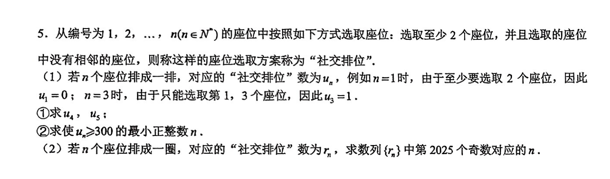

## A

设 $a_i$ 表示长度为 $i$ 的线性排列的合法方案数（不考虑至少两个的限制），那么有 $a_n = a_{n - 1} + a_{n - 2}$，初值为 $a_0 = 1, a_1 = 2$，不难发现这就是斐波那契数列向右平移后的结果。

减掉不合法的方案，得到 $u_n = a_n - (n + 1)$。直接枚举即可得到第一问的答案。

考虑第二问，区别在于 $1$ 和 $n$ 不能同时选，减掉这种不合法的方案即可。发现同时选择 $1$ 和 $n$ 时， $2$ 和 $n - 1$ 都不能选，那么方案数为 $a_{n - 4}$。

故 $r_n = u_{n} - a_{n - 4} (n \ge 4)$，同时显然 $r_1=r_2=r_3=0$。

进一步化简可得 $r_n =a_{n - 2} + 2a_{n - 3} - (n + 1)$，然后找规律。发现从 $r_4$ 开始，奇偶性周期为 $6$：偶奇奇奇偶偶。容易计算答案。